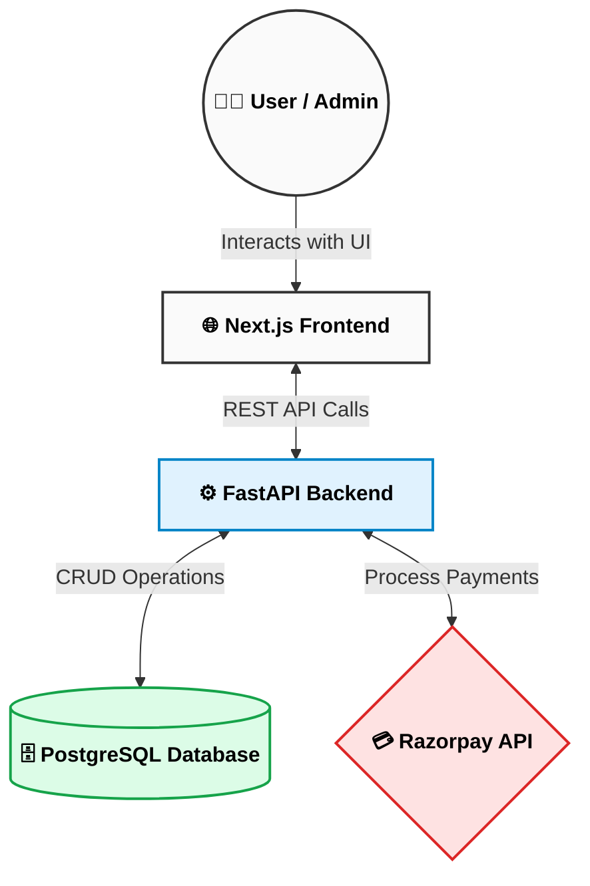

# 🚀 InternVision Tech - Full-Stack EdTech & Internship Platform

> **A modern, high-contrast Full-Stack EdTech & Pre-Hire Internship Platform (Fully Functional & Deployed for Evaluation).** Built with Next.js 15 (React 19), FastAPI, PostgreSQL (Supabase IPv4 Connection Pooler), Razorpay Payment Gateway, and JWT-authenticated Admin Portal.


---

## 📐 System Architecture & Software Workflow



## 🎨 Human-Centered Brutalist Design Philosophy

This project intentionally rejects generic "AI slop" aesthetics (floating purple blurs, soft glassmorphism gradients, and generic cards) in favor of an **assertive, human-centered brutalist design system**:

- **Stark Contrast**: Solid dark backgrounds (`bg-ink-950`) combined with high-contrast text (`font-black` headers, dense uppercase microcopy).
- **Asymmetric Layouts**: Intentional grid offsets (`col-span-5` vs `col-span-7`), tilted accent badges (`-rotate-1`), and varied spacing.
- **Tactile Shadows & Borders**: Sharp 2px borders (`border-ink-800`) with solid block drop-shadows (`shadow-[8px_8px_0px_#1a1915]`).
- **Snappy Performance**: Removed overused scroll-fade animations for instant DOM rendering and fast interactive state transitions.

---

## 🔑 Demo Admin Credentials

> [!IMPORTANT]
> - **Admin Email**: `admin@internvision.tech`
> - **Admin Password**: `Admin@123456`
> - **Admin Login Route**: `/admin/login`

---

## 🌟 Key Features Overview

### 🌐 Public Portal & Course Catalog
- **Course Exploration**: Browse courses with category filtering, level badges, tech tags, and INR pricing.
- **Syllabus Details**: Comprehensive learning outcomes, technologies covered, and instant enrollment modal.
- **Internship Application**: Apply for 1-month, 3-month, or 6-month hands-on pre-hire engineering tracks.

### 🔐 Admin Dashboard & Export System
- **Real-Time Metrics**: Track total applications, registrations, revenue (INR), and conversion metrics.
- **Data Filtering**: Filter candidate applications by status (`pending`, `reviewed`, `accepted`, `rejected`).
- **Excel (.xlsx) Data Export**: Instant 1-click download of all application records and payment audit logs in standard `.xlsx` spreadsheet format.

---

## 🌐 Live Deployment & Infrastructure

| Component | Platform | Configuration & Details |
| :--- | :--- | :--- |
| **Frontend** | **Vercel** | Next.js 15 (App Router), React 19, Edge Runtime & Client Components |
| **Backend** | **Render** | FastAPI (Python 3.11), Uvicorn ASGI Server |
| **Database** | **Supabase PostgreSQL** | SQLAlchemy 2.0 ORM, IPv4 Connection Pooler (`:6543`) |
| **Payments** | **Razorpay** | Test Mode API Integration, HMAC-SHA256 verification |

---

## 🛠️ Tech Stack & Architecture

| Layer | Technology | Key Usage |
| :--- | :--- | :--- |
| **Frontend** | **Next.js 15 (App Router)** | React 19, Server & Client Components, TypeScript |
| **Styling** | **Tailwind CSS** | Brutalist Theme Tokens, Custom Ink Palette (`ink-950`) |
| **Backend** | **FastAPI (Python 3.11)** | Async REST API, Pydantic v2 validation, Uvicorn |
| **Database** | **PostgreSQL & Supabase** | Session ORM via SQLAlchemy 2.0, IPv4 Pooler (:6543) |
| **Authentication**| **JWT (JSON Web Tokens)** | Passlib (Bcrypt) password hashing, AuthGuard |
| **Payments** | **Razorpay SDK** | Test Mode checkout, HMAC-SHA256 verification |
| **Exports** | **OpenPyXL** | Native Excel (.xlsx) report generation |

---

## 🚀 Quick Start & Setup Guide

### 1. Backend Setup
```bash
cd backend

# Create & activate virtual environment
python -m venv venv
# On Windows:
venv\Scripts\activate
# On macOS/Linux:
# source venv/bin/activate

# Install dependencies
pip install -r requirements.txt

# Run database seed script (Admin user & initial courses)
python -m app.seed

# Start FastAPI Uvicorn development server
python -m app.main
```
- **API Base URL**: `http://localhost:8000/api`
- **Interactive Swagger Docs**: `http://localhost:8000/docs`
- **Health Check Endpoint**: `http://localhost:8000/api/health`

### 2. Frontend Setup
```bash
cd frontend

# Install Node dependencies
npm install

# Start Next.js development server
npm run dev
```
- **Web App**: `http://localhost:3000`
- **Admin Portal**: `http://localhost:3000/admin/login`

---

## 📡 API Endpoints Summary

| Endpoint | Method | Description | Auth |
| :--- | :---: | :--- | :---: |
| `GET /api/health` | `GET` | System health check & PostgreSQL connection status | Public |
| `GET /api/courses` | `GET` | Fetch course catalog | Public |
| `GET /api/courses/{slug}` | `GET` | Fetch specific course details by slug | Public |
| `POST /api/applications` | `POST` | Submit student internship application | Public |
| `POST /api/payments/create-order` | `POST` | Generate Razorpay payment order | Public |
| `POST /api/payments/verify` | `POST` | Verify Razorpay payment HMAC signature | Public |
| `POST /api/auth/login` | `POST` | Admin authentication & JWT token issuance | Public |
| `GET /api/admin/applications` | `GET` | Fetch all internship applications | **JWT** |
| `GET /api/admin/payments` | `GET` | Fetch all payment records | **JWT** |
| `GET /api/admin/stats` | `GET` | Fetch real-time dashboard analytics | **JWT** |
| `GET /api/admin/export/applications` | `GET` | Generate Excel (.xlsx) export of applications | **JWT** |
| `GET /api/admin/export/payments` | `GET` | Generate Excel (.xlsx) export of payment logs | **JWT** |

---

## 📁 Repository Structure

```
internvision-prehire-assignment/
├── backend/
│   ├── app/
│   │   ├── auth/            # Admin JWT Authentication
│   │   ├── core/            # Config, Security & Tracing Middleware
│   │   ├── courses/         # Course Catalog Models & Routers
│   │   ├── dashboard/       # Admin Analytics & Management
│   │   ├── export/          # Excel (.xlsx) File Exports
│   │   ├── internship/      # Application Processing
│   │   ├── payments/        # Razorpay Integration & Signature Verification
│   │   └── shared/          # Database ORM Base & Exception Handlers
│   ├── main.py              # Application Entry Point
│   ├── seed.py              # Database Seeder
│   └── requirements.txt     # Python Dependencies
├── frontend/
│   ├── src/
│   │   ├── app/             # Next.js 15 App Router Pages
│   │   ├── components/      # UI Cards, Navbar, Footer, Animations
│   │   ├── lib/             # API Client & Utility Helpers
│   │   └── types/           # TypeScript Definitions
│   ├── package.json
│   └── tailwind.config.js
└── README.md
```

---

*Built with precision for InternVision Tech.*

